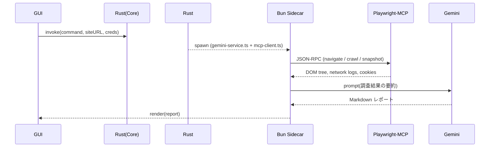

## 概要

本エージェントは GUI（Tauri + Bun/TypeScript）から受け取った自然言語の指示に従い、Playwright-MCP／Puppeteer-MCP を用いて **大学の学生ポータルサイト**へログイン → 画面・API 呼び出し・DOM 構造を動的に探索し、Google Gemini で分析・要約レポートを生成する。目的は “自動化ツールを作るための技術調査ドキュメント” を作成することである。MCP によるブラウザ操作、Gemini による要約、Tauri Stronghold によるキー・Cookie 保護、OpenTelemetry による計測を含む。

---

## 1. 目的

> 学生ポータルサイトの画面遷移・API・DOM 構造・認証方式を解析し、
> *「自動ログイン」「成績・履修情報取得」「通知監視」* などを自動化するための技術調査レポート（Markdown）を生成する。

---

## 2. エージェント呼び出しフロー



* **Playwright-MCP** は複数ブラウザで安定した自動化を提供し、探索用のアクセシビリティスナップショット API を備える。
* **Gemini** はサーバーサイド SDK 経由で呼び出し、トークン上限とレート制限を考慮する。

---

## 3. 使用ツール定義（MCP 2025-03-26）

```jsonc
{
  "schema_version": "2025-03-26",
  "tools": [
    {
      "name": "mcp.playwright",
      "description": "Browser automation for exploration",
      "timeout_ms": 45000,
      "session_id": "student-portal"
    },
    {
      "name": "mcp.puppeteer",
      "description": "Fallback automation (Chromium only)",
      "timeout_ms": 45000,
      "session_id": "student-portal"
    },
    {
      "name": "gemini.generate",
      "description": "Generate investigation report"
    }
  ]
}
```

---

## 4. プロンプトテンプレート（Bun sidecar）

```text
SYSTEM:
You are PortalResearchAgent. Your goal is to reverse-engineer a university
student portal to enable future automation.

TASKS:
1. Log in with provided credentials.
2. Crawl main pages: Dashboard, Grades, Registration, Notifications.
3. Capture:
   • DOM hierarchy (role, id, aria-label) up to depth 3
   • All XHR/fetch endpoints and response samples
   • Visible text of menus, tables, and status indicators
4. Identify auth method (cookie, SSO, MFA) and session refresh flow.
5. Summarize findings in Japanese Markdown with:
   - 画面一覧と URL
   - DOM クエリ例 (CSS / ARIA)
   - 必須リクエスト例 (method, endpoint, payload)
   - 自動化時の注意点・法的留意事項

OUTPUT: Markdown only.
```

---

## 5. 機能要件（追加・修正）

| ID  | 要件                                                                                              |
| --- | ------------------------------------------------------------------------------------------------- |
| F-1 | **サイトマップ自動生成**：探索したリンク構造を Graphviz DOT で出力し GUI でプレビュー。           |
| F-2 | **API 呼び出しリスト**：XHR / fetch を傍受し、URL・メソッド・サンプルペイロードを JSON で保存。   |
| F-3 | **認証方式検出**：フォーム vs SSO vs MFA を自動判断し、再ログイン手順を提案。                     |
| F-4 | **法的・倫理ガイド**：スクレイピングの利用規約違反・著作権・Fair Use に関する注意書きを必ず添付。 |
| F-5 | **レポート生成**：Gemini で「調査結果 Markdown」「TODO リスト」「推奨自動化フロー」を返す。       |

---

## 6. 非機能要件（重要ポイント）

| 区分           | 要件                                                          | 出典 |
| -------------- | ------------------------------------------------------------- | ---- |
| セキュリティ   | Stronghold で API キーと Cookie を AES-GCM 保管。             |      |
| パフォーマンス | 1 ページ探索 ≤ 5 s、レポート生成 ≤ 30 s。                     |      |
| レート制御     | Gemini 無料枠 60 req/min・24 k token/day を GUI で可視化。    |      |
| 観測性         | Bun + OpenTelemetry で span, error, network size を収集。     |      |
| ブラウザ互換   | Playwright-MCP（Chromium / Firefox / WebKit）を CI でテスト。 |      |

---

## 7. 例外ハンドリング

| シナリオ      | 処理                                                              |
| ------------- | ----------------------------------------------------------------- |
| MFA / CAPTCHA | ユーザー介入を促すメッセージと一時停止フロー。                    |
| 認可エラー    | ステータス 401/403 を自動検出し再ログイン → 失敗時は GUI に警告。 |
| レート超過    | 待機（Retry-After）キューイング、GUI に残トークン表示。           |

---

## 8. テスト & CI

1. **Unit**：Vitest + Bun でロジック検証。
2. **E2E**：Playwright ヘッドレス 3 ブラウザでポータルのダミー環境をテスト。
3. **Build**：`cargo tauri build --ci` → Notarization / CodeSign → Updater Feed。
4. **Telemetry**：CI 内で OpenTelemetry span 断面を検証。

---

## 9. 法的・倫理ガイドライン

* 大学の利用規約を確認し、**スクレイピング許可の有無**を調査。
* 著作権物の複製に該当する場合は「私的複製」「教育目的の Fair Use」かを検討。
* 大量アクセスによる可用性影響を避けるため、**crawl-delay** とトラフィック上限を守る。

---

## 10. 完了判定

1. テスト用学生ポータル（例：`https://manabo.cnc.chukyo-u.ac.jp/auth/shibboleth/`）にログインし、
2. ページ・API・DOM・Auth の情報を自動収集、
3. GUI 上に **Markdown 調査レポート + DOT サイトマップ + JSON API 一覧** が表示される。

以上を満たせば MVP 達成と定義する。
