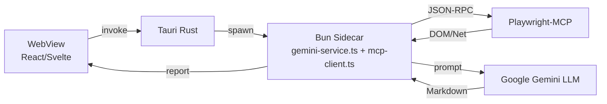

# 学生ポータルリサーチエージェント (Student Portal Research Agent)

大学の **学生ポータルサイト** を自動解析し、ページ構造・API エンドポイント・DOM 階層・認証フローなどをまとめた **Markdown 調査レポート** を生成するデスクトップアプリです。目的は「自動ログイン」「成績取得」「通知監視」などの自動化ツール開発を加速させることにあります。

---

## ✨ 主な機能

| 分野                   | 詳細                                                                                                       |
| ---------------------- | ---------------------------------------------------------------------------------------------------------- |
| **GUI**                | **Tauri** (Rust コア) + **Bun／TypeScript** フロントエンドによるクロスプラットフォーム・デスクトップアプリ |
| **ブラウザ自動化**     | **Playwright‑MCP** (Chromium / Firefox / WebKit) ＋ **Puppeteer‑MCP** フォールバック                       |
| **LLM 解析**           | サーバーサイド **Google Gemini 1.5 Pro** によるポータル内部構造の要約                                      |
| **秘密情報管理**       | `tauri-plugin-stronghold` で API キー & Cookie を AES‑GCM 暗号化保存                                       |
| **オブザーバビリティ** | OpenTelemetry による span / metric を OTLP でエクスポート                                                  |
| **出力**               | *Markdown* 調査レポート、*Graphviz DOT* サイトマップ、*JSON* API 一覧、Playwright Trace ZIP                |

---

## 📐 アーキテクチャ



---

## 🚀 クイックスタート

### 1. 前提条件

| ツール                 | バージョン目安                                                          |         |
| ---------------------- | ----------------------------------------------------------------------- | ------- |
| **Rust**               | 1.76 以上 (cargo 含む)                                                  |         |
| **Tauri CLI**          | `cargo install tauri-cli`                                               |         |
| **Bun**                | 1.3 以上 (\`curl -fsSL [https://bun.sh/install](https://bun.sh/install) | bash\`) |
| **Playwright-MCP**     | `npm i -g playwright-mcp-server`                                        |         |
| **Puppeteer-MCP**      | (任意、フォールバック用)                                                |         |
| **Google Gemini キー** | `GEMINI_API_KEY`                                                        |         |

### 2. クローン & インストール

```bash
# リポジトリを取得
git clone https://github.com/dokimiki/chukyo-bunseki.git
cd chukyo-bunseki

# JS 依存を Bun でインストール
bun install

# Rust 依存を取得 (一度だけ)
cargo fetch
```

### 3. 環境変数設定

ルートに `.env` を作成:

```dotenv
GEMINI_API_KEY="sk-..."
MCP_PLAYWRIGHT_PORT=5001
MCP_PUPPETEER_PORT=5002  # optional
```

### 4. 開発モードで起動

> 2 つの長時間プロセス（Bun サイドカー & Playwright‑MCP）が自動で立ち上がります。

```bash
bun dev              # Vite dev + Bun sidecar + Playwright‑MCP

# 2 個目のターミナル (任意: Trace ビューア)
bun run trace:ui     # Playwright Trace Viewer を起動
```

アプリウィンドウが開くので、サイト URL と認証情報を入力して調査を開始してください。

### 5. 配布パッケージをビルド

```bash
bun run build        # フロントエンドを Bun でバンドル
cargo tauri build    # .dmg / .msi / .AppImage + アップデータ JSON を生成
```

---

## 🧪 テスト & CI

| レイヤ                     | コマンド                                                                 |
| -------------------------- | ------------------------------------------------------------------------ |
| **ユニットテスト**         | `bunx vitest`                                                            |
| **E2E（ダミー ポータル）** | `bun test:e2e` (Playwright ヘッドレス: Chromium / Firefox / WebKit)      |
| **Lint**                   | `bunx eslint .`                                                          |
| **CI**                     | GitHub Actions: install → lint → unit → e2e → build → notarize → release |

---

## 🔐 セキュリティメモ

* **キー & Cookie** は Stronghold 内にのみ保存し、WebView へ露出しません。
* Content Security Policy は `default-src 'self'` をデフォルトとし、リモート IPC を禁止。
* すべてのバイナリはコード署名済みで、自動更新時に署名検証が行われます。
* 対象ポータルの利用規約と `crawl-delay` 指示に従ってください。

---

## 📂 ディレクトリ構成 (簡易版)

```
portal-research-agent/
├─ apps/
│  ├─ desktop/           # Tauri フロントエンド (src-tauri + web)
│  └─ mcp-bridge/        # Bun サイドカーサービス
├─ packages/
│  ├─ shared/            # Zod スキーマ & TS 型
│  └─ ui-components/     # 再利用可能な React コンポーネント
├─ tests/                # Vitest & Playwright テスト
└─ docs/                 # AGENT.md, ADR, フローダイアグラム等
```
